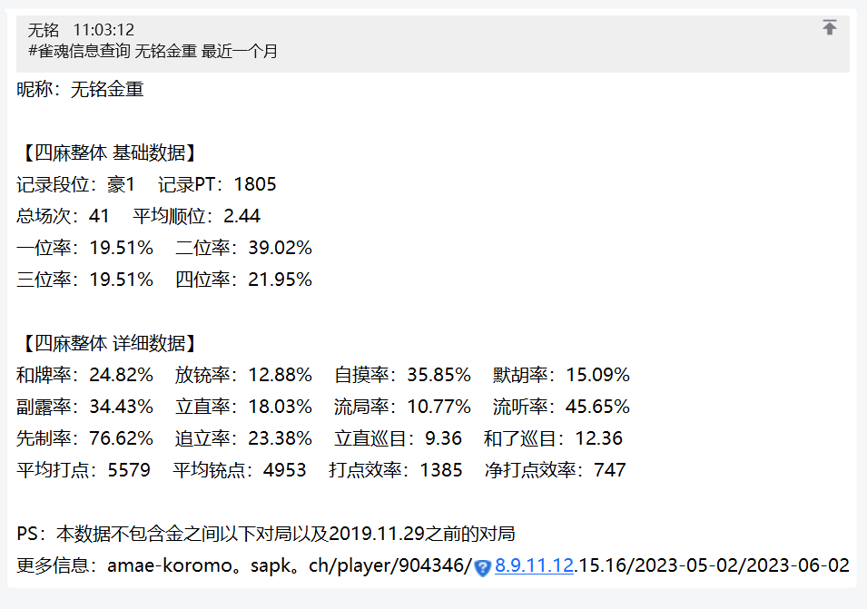

nonebot-plugin-escape-url
========

自动转换发送消息中的URL🤔

支持适配器：OneBot V11 ~~（其他的等一个有缘人PR）~~

## 卖家秀

使用前：

使用后：

## 配置项

### escape_url_replace_dot_by

将URL中的点替换为

类型：`str`

默认值：`"。"`

### escape_url_ignore_adapters

不进行转换的适配器

类型：`List[str]`

默认值：`[]`